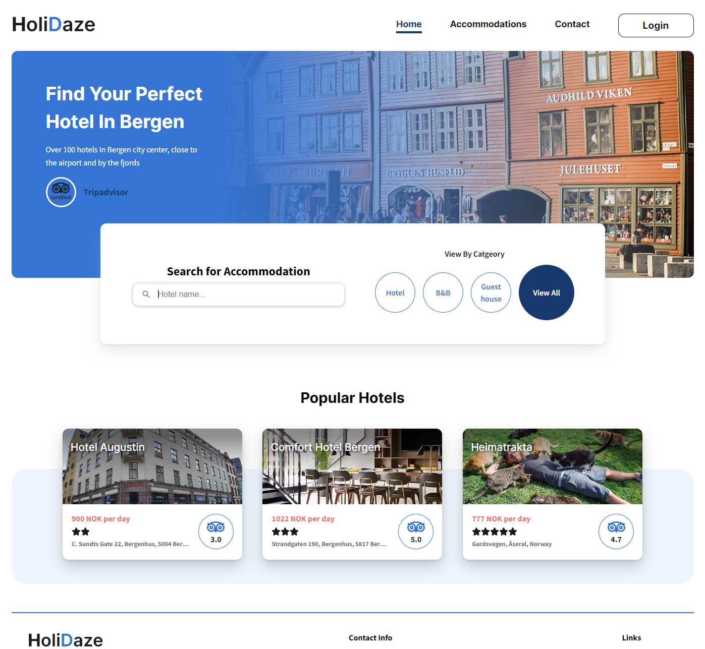

# Holidaze - Hotel Booking Website

## Description
Holidaze is a local tourism agency in Bergen which lists hotels, B&Bs and guesthouses for visitors in the area. The accommodation owners will receive enquiries through a booking form for a choosen accommodation. 

The project has a visitor side for users searching for accommodation and making enquiries, sa well as an administration side where accommodation owners can add/delete establishments and manage enquiries. The admin for Holidaze will also receive messages from a contact form for general questions. 

The project is setup with a rest API on Strapi where the establishments, messages and enquiries are stored. Users and facilities for the accommodations are also stored on the API. 

* Visitor side
* Admin side
* Strapi rest API

## Built With
* React.js
* SCSS
* Material UI
* Strapi
* Google maps API

## Getting Started
### Installing
1. Clone the repo:
`git clone https://github.com/glennlarsen/project-exam-2-glennlarsen.git`
Clones the repo to your choosen destination.

2. Install the dependencies:
`npm install`
Install's all the required dependencies to run the project.

### Running
`npm run start`
Runs the app in the development mode.\
Open [http://localhost:3000](http://localhost:3000) to view it in your browser.

### Admin Login
User: admin
Password: 12345678
Admin user login to enter the admin side.

## Contributing
Contributions to the project are very much appreaciated. To contribute please open a pull request so the code can be reviewed.

## Contact
[My LinkedIn Page](https://www.linkedin.com/in/glenn-larsen-288173242/)
[My Facebook Page](https://www.facebook.com/glenn.larsen.96)

